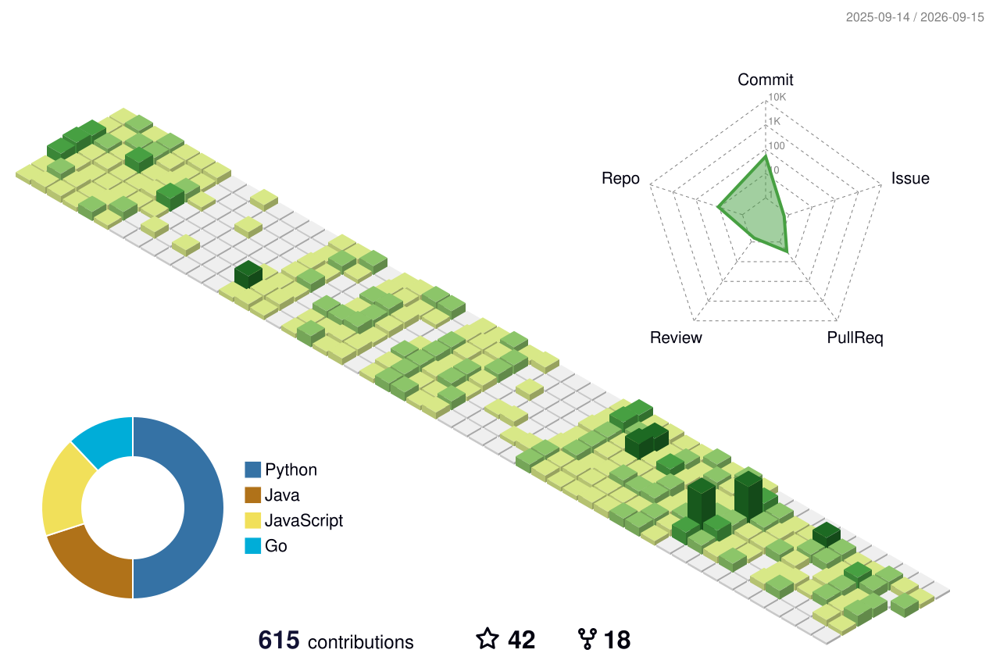

  

<h1 align="center">Hi 👋 I'm Shivam</h1>

<h3 align="center">Software Engineer • Full Stack Developer • Cloud Enthusiast</h3>

## 👨‍💻 About Me

<table cellpadding="10">
<tr>
<td width="340" valign="middle">

</td>
<td valign="middle">

- 💼 **Role:** Software Engineer
- 🌱 **Currently Building:** Production-grade systems & scalable backends
- ❤️ **Passionate About:** Full Stack Development (React, Next.js, Spring Boot, Node.js)
- ☁️ **Exploring:** AWS, Docker & Kubernetes
- 🛠️ **Interests:** FOSS & Productivity Tools
- 📚 **Always Learning:** New technologies
- 🌅 **Early Bird:** Mornings are for shipping code
- 🎌 **Offline:** Watching anime

</td>
</tr>
</table>

## 🛠️ Tech Stack

  
  
  
  
  
  
  
  
  
  
  
  
  
  
  
  
  
  
  
  
  
  
  
  
  
  
  
  
  
  
  
  
  

<h3 align="left">📌 Pinned Repos</h3>

<!-- PINNED-REPOS:START -->

| Repository | Description |
| :--- | :--- |
| **[shvmpk/url-shortener](https://github.com/shvmpk/url-shortener)** | An advanced, production-grade URL shortening service built for internet-scale systems. Designed with scalability, observability, and extensibility in mind — yet still under active development with new features being added regularly. |
| **[shvmpk/linkedin-ai-composer](https://github.com/shvmpk/linkedin-ai-composer)** | A privacy-first Chrome extension that generates LinkedIn posts in your own voice using your own AI provider — cloud or local. No backend, no subscription, no data leaves your browser |
| **[shvmpk/github-contributor-bot](https://github.com/shvmpk/github-contributor-bot)** | 🤖 A high-performance, zero-dependency Go-based bot that fully automates a realistic GitHub commits with human-like behavior — random times, realistic messages, rest days, sprint days, and branch simulations. Runs fully automated via GitHub Actions. No Node.js or Python required. |
| **[shvmpk/spring-ai-local-rag](https://github.com/shvmpk/spring-ai-local-rag)** | Document Search & Insights Platform (Local AI Chat + Document ETL + Model Management Platform) |
| **[shvmpk/next-hire-ai](https://github.com/shvmpk/next-hire-ai)** | Seamless and intuitive experience for job seekers and recruiters to analyze resumes (CVs) based on job descriptions. |
| **[shvmpk/tvflix](https://github.com/shvmpk/tvflix)** | Tvflix is a simple and responsive web app built using Vanilla JS, leveraging the power of Postman and the TMDB API to seamlessly fetch and display comprehensive movie details. This project serves as a template for larger applications. |
| **[shvmpk/SayGPT](https://github.com/shvmpk/SayGPT)** | Full stack AI-Chat GPT Clone, Uses Gemini to get query and image responses. Minimalistic Responsive UI with Full authentication and User Secure. |

<!-- PINNED-REPOS:END -->

<h3 align="left">📊 GitHub Stats</h3>

<h3 align="left">🌟 Top Followers</h3>

<!--START_SECTION:top-followers-->
<table>
  <tr>
    <td align="center">
      
       
      <a href="https://github.com/johnny-rice">Johnny Rice</a>
    </td>
    <td align="center">
      
       
      <a href="https://github.com/samruddhibaviskar11">Samruddhi Baviskar</a>
    </td>
    <td align="center">
      
       
      <a href="https://github.com/esin">Andrey Esin</a>
    </td>
    <td align="center">
      
       
      <a href="https://github.com/helallao">Ali Yaşar</a>
    </td>
    <td align="center">
      
       
      <a href="https://github.com/seckinyasar">Seckin Yasar</a>
    </td>
    <td align="center">
      
       
      <a href="https://github.com/felicityblueish">Felicity</a>
    </td>
    <td align="center">
      
       
      <a href="https://github.com/mmertpolat">Muhammet Mert Polat</a>
    </td>
  </tr>
  <tr>
    <td align="center">
      
       
      <a href="https://github.com/Ryuk-me">Neeraj Kumar</a>
    </td>
    <td align="center">
      
       
      <a href="https://github.com/rahman-O">Abdalrahman M.Mohhy</a>
    </td>
    <td align="center">
      
       
      <a href="https://github.com/AbdoXCode">Abdelrhman Ayman</a>
    </td>
    <td align="center">
      
       
      <a href="https://github.com/David-Horjet">David Horjet</a>
    </td>
    <td align="center">
      
       
      <a href="https://github.com/samrahimi">Sam Rahimi</a>
    </td>
    <td align="center">
      
       
      <a href="https://github.com/zlr-raja">Rajashekhar</a>
    </td>
    <td align="center">
      
       
      <a href="https://github.com/Ritam-jash">Ritam Jash</a>
    </td>
  </tr>
  <tr>
    <td align="center">
      
       
      <a href="https://github.com/decoder-17">Tanupam Saha</a>
    </td>
    <td align="center">
      
       
      <a href="https://github.com/rj-rishav">rj-rishav</a>
    </td>
    <td align="center">
      
       
      <a href="https://github.com/nirajpd">Niraj Prasad</a>
    </td>
    <td align="center">
      
       
      <a href="https://github.com/Brigoliboon">Brigoliboon</a>
    </td>
    <td align="center">
      
       
      <a href="https://github.com/OmTiwary">Om Tiwary</a>
    </td>
    <td align="center">
      
       
      <a href="https://github.com/sagarscaminosoftai">sagar sharma</a>
    </td>
    <td align="center">
      
       
      <a href="https://github.com/Sypher0Dronzer">Soham Saha</a>
    </td>
  </tr>
  <tr>
    <td align="center">
      
       
      <a href="https://github.com/gsiddhi04">gsiddhi04</a>
    </td>
    <td align="center">
      
       
      <a href="https://github.com/Acharaya">Aryan</a>
    </td>
  </tr>
</table>
<!--END_SECTION:top-followers-->
